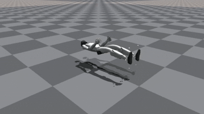
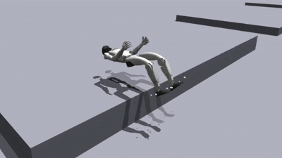
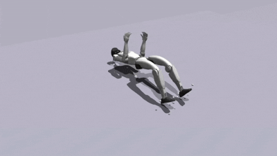
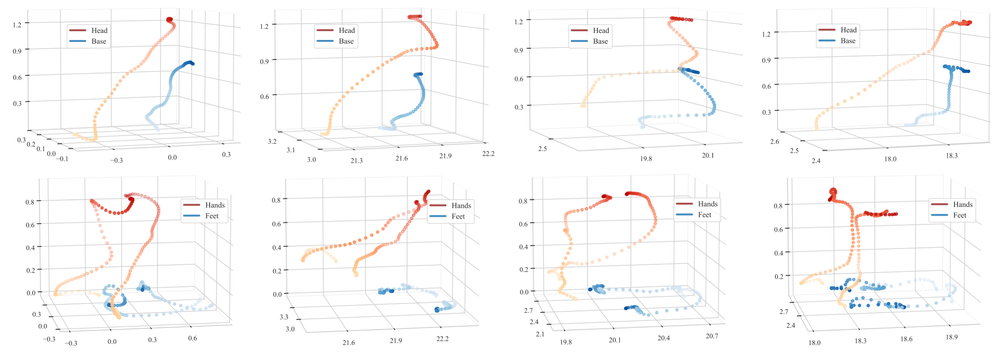
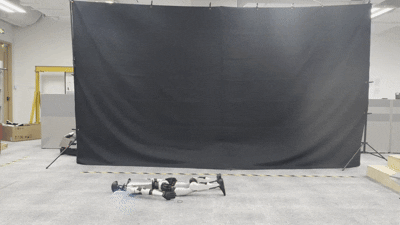
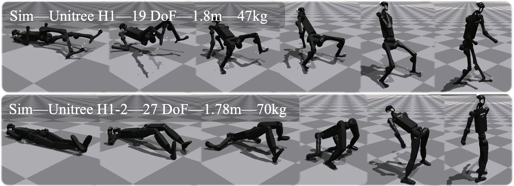
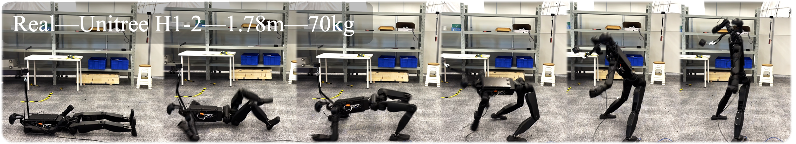

# HoST: Humanoid Standing-up Control

[](https://arxiv.org/abs/2502.08378)
[](https://taohuang13.github.io/humanoid-standingup.github.io/)
[](https://www.youtube.com/watch?v=Yruh-3CFwE4)
[](https://www.bilibili.com/video/BV1o2KPeUEob/?spm_id_from=333.337.search-card.all.click&vd_source=ef6a9a20816968cc19099a3f662afd86)
[]()


This is the official PyTorch implementation of the RSS conference paper "[**Learning Humanoid Standing-up Control across Diverse Postures**](https://arxiv.org/abs/2502.08378)" by 

[Tao Huang](https://taohuang13.github.io/), [Junli Ren](https://renjunli99.github.io/), [Huayi Wang](https://why618188.github.io/), [Zirui Wang](https://scholar.google.com/citations?user=Vc3DCUIAAAAJ&hl=zh-TW), [Qingwei Ben](https://www.qingweiben.com/), [Muning Wen](https://scholar.google.com/citations?user=Zt1WFtQAAAAJ&hl=en), [Xiao Chen](https://xiao-chen.tech/), [Jianan Li](https://github.com/OpenRobotLab/HoST), [Jiangmiao Pang](https://oceanpang.github.io/)

<p align="left">
  
</p>

## 📑 Table of Contents
- [🔥 News](#-news)
- [📝 TODO List](#-todo-list)
- [🛠️ Installation Instructions](#-installation-instructions)
- [🤖 Run HoST on Unitree G1](#-run-host-on-unitree-g1)
- [🧭 Extend HoST to Other Humanoid Robots](#-extend-host-to-other-humanoid-robots-tips)
- [✉️ Contact](#-contact)
- [🏷️ License](#-license)
- [🎉 Acknowledgments](#-acknowledgments)
- [📝 Citation](#-citation)

## 🔥 News
- \[2025-04\] We release traning code, evaluation scripts, and visualization tools.
- \[2025-04\] HoST was accepted to RSS 2025!
- \[2025-02\] We release the [paper](https://taohuang13.github.io/humanoid-standingup.github.io/assets/paper.pdf) and [demos](https://taohuang13.github.io/humanoid-standingup.github.io/) of HoST.


## 📝 TODO List 
- [x] Training code of Unitree G1 across prone postures.
- [x] Training code of Unitree H1.
- [ ] Joint training of supine and prone postures.
- [ ] Joint training over all terrains.


## 🛠️ Installation Instructions
Clone this repository:
```bash
git clone https://github.com/OpenRobotLab/HoST.git
cd HoST
```
Create a conda environment:
```bash
conda env create -f conda_env.yml 
conda activate host
```
Install pytorch 1.10 with cuda-11.3:
```bash
pip3 install torch==1.10.0+cu113 torchvision==0.11.1+cu113 torchaudio==0.10.0+cu113 -f https://download.pytorch.org/whl/cu113/torch_stable.html
```

Download and install [Isaac Gym](https://developer.nvidia.com/isaac-gym):
```bash
cd isaacgym/python && pip install -e .
```
Install rsl_rl (PPO implementation) and legged gym:
```bash
cd rsl_rl && pip install -e . && cd .. 
cd legged_gym &&  pip install -e . && cd .. 
```
### Erorr Catching
Regarding potential installation errors, please refer to [this document](docs/ERROR.md) for solutions. 

## 🤖 Run HoST on Unitree G1
### Overview of Main Simulation Motions
<table style="width: 100%; border-collapse: collapse; margin: -5px -0px -12px 0px;">
    <tr>
        <td align="center" style="width: 24%; padding: 2px;">
            <br/>
            <span style="font-size: 0.9em;">Ground</span>
        </td>
        <td align="center" style="width: 24%; padding: 2px;">
            <br/>
            <span style="font-size: 0.9em;">Platform</span>
        </td>
        <td align="center" style="width: 24%; padding: 2px;">
            <br/>
            <span style="font-size: 0.9em;">Wall</span>
        </td>
        <td align="center" style="width: 24%; padding: 2px;">
            <br/>
            <span style="font-size: 0.9em;">Slope</span>
        </td>
    </tr>
</table>

### Policy Training
Train standing-up policies over different terrains:
```bash
python legged_gym/scripts/train.py --task g1_${terrain} --run_name test_g1 # [ground, platform, slope, wall]
```

After training, you may play the resulted checkpoints:
```bash
python legged_gym/scripts/play.py --task g1_${terrain} --checkpoint_path ${/path/to/ckpt.pt} # [ground, platform, slope, wall]
```

### Policy Evaluation
We also provide the evaluation scripts to record success rate, feet movement distance, motion smoothness, and consumed energy:
```bash
python legged_gym/scripts/eval/eval_${terrain}.py --task g1_${terrain} --checkpoint_path ${/path/to/ckpt.pt} # [ground, platform, slope, wall]
```
Domain randomization is applied during the evaluation to make the results more generalizable. 

### Motion Visualization
<p align="left">
  
</p>


First, run the following command to collect produced motion:
```bash
python legged_gym/scripts/visualization/motion_collection.py --task g1_${terrain} --checkpoint_path ${/path/to/ckpt.pt} # [ground, platform, slope, wall]
```

Second, plot the 3D trajectories of motion keyframes:
```bash
python legged_gym/scripts/visualization/trajectory_hands_feet.py  --terrain ${terrain} # [ground, platform, slope, wall]
python legged_gym/scripts/visualization/trajectory_head_pelvis.py  --terrain ${terrain} # [ground, platform, slope, wall]
```

### Train from Prone Postures
<table style="width: 100%; border-collapse: collapse; margin: -5px -0px -0px 0px;">
    <tr>
        <td align="center" style="width: 33%; padding: 3px;">
            <br/>
            <span style="font-size: 0.9em;">Left-side Lying</span>
        </td>
        <td align="center" style="width: 33%; padding: 3px;">
            <br/>
            <span style="font-size: 0.9em;">Prone</span>
        </td>
        <td align="center" style="width: 33%; padding: 3px;">
            <br/>
            <span style="font-size: 0.9em;">Right-side Lying</span>
        </td>
    </tr>
</table>

We also support the training from prone postures:
```bash
python legged_gym/scripts/train.py --task g1_ground_prone --run_name test_g1_ground_prone
```
The learned policies can also handle side-lying postures. However, when training from posture postures, harder constraints on hip joints and are necessary to prevent violent motions. This issue make the feasibility of joint training from prone and supine postures unclear currently. Address it would be valuable in the future.

## 🧭 Extend HoST to Other Humanoid Robots: Tips 
### Lessons Learned from Unitree H1 and H1-2
<p align="left">
  
</p>
To try other robots, these steps should be followed to work the algorithm:

* [Add keyframes in urdf](./legged_gym/resources/robots/g1/g1_23dof.urdf#L970): It is suggested to add the same keyframes (including keypoints around ankles) as ours to strengthen the compatibility with new robots. These keyframes are designed for reward computation.
* [Pulling force](./legged_gym/legged_gym/envs/g1/g1_config_ground.py#L296): ~60% gravity of the robot. Note that we have two torso link (one real, one virtual) in G1's urdf, so the force will be multiplied by 2 during training. Besides, you may modify the condition of applying force, e.g., remove the base orientation condition.
* [Height for curriculum](./legged_gym/legged_gym/envs/g1/g1_config_ground.py#L299): ~70% height of the robot.
* [Height for stage division](./legged_gym/legged_gym/envs/g1/g1_config_ground.py#L189): ~35% height of the robot for stage 1 and 2, and ~70% height of the robot for stage 3.
* [Height for reward](./legged_gym/legged_gym/envs/g1/g1_config_ground.py#L187): ~75% for target_head_height. Regarding the [target base height](./legged_gym/legged_gym/envs/g1/g1_config_ground.py#L183) after success a standing up, it depends on your preference.
* [Joint deviation rewards](./legged_gym/legged_gym/envs/g1/g1_config_ground.py#L231): You can adjust the style reward functions, particularly the joint deviation penalties, to better constrain the motion style. Lightweight robots typically require narrower desired joint angle ranges, as they are more prone to reaching extreme joint angles.
* [Reward group weights](./legged_gym/legged_gym/envs/g1/g1_config_ground.py#L200): For instance, improving the weight of style rewards may priotirize the optimization on the motion. This is helpful on learning H1-2 or across prone postures.
* [Misc](./legged_gym/legged_gym/envs/g1/g1_config_ground.py): You should also modify the default/target postures, PD controllers, observation/action spaces, body names, and etc.

As an example, we provied the training code of Unitree H1 over the ground:
```bash
python legged_gym/scripts/train.py --task h1_ground --run_name test_h1_ground 
```

### Potential Tips for Hardware Deployment
<p align="left">
  
</p>
We found some useful tips for working G1 and H1-2 hardware systems:

* **High stiffness for knee and hip joints:** We found that improving the kp coefficients of these joints to ~1.5x of the simulation ones significantly helps. We posit that this is caused by the sim-to-real gap between the joint torques. See more analysis in the [paper](https://arxiv.org/abs/2502.08378).
* **High action rescaler**: While default action rescaler (0.25) already produces good motions, we found that a slight improvement of this coefficient (0.3) can mitigate jerky motions noticeably.
* **Check collision models**: We found that using full meshes as the collision models for ankles will cause huge sim-to-real gap. To solve this issue, we use discrete points to approximate the collision, following the [official code of Unitree](https://github.com/unitreerobotics/unitree_rl_gym). That being said, it is highly suggested to be more careful about collision models. 

## ✉️ Contact
For any questions, please feel free to email taou.cs13@gmail.com. We will respond to it as soon as possible. Or, you can join our discussion wechat group:

<p align="center">
  
</p>

## 🏷️ License
This repository is released under the MIT license. See [LICENSE](LICENSE) for additional details.

## 🎉 Acknowledgments
This repository is built upon the support and contributions of the following open-source projects. Special thanks to:

* [legged_gym](https://github.com/leggedrobotics/legged_gym) and [HIMLoco](https://github.com/OpenRobotLab/HIMLoco): The foundation for training and running codes.
* [rsl_rl](https://github.com/leggedrobotics/rsl_rl.git): Reinforcement learning algorithm implementation.
* [walk these ways](https://github.com/Improbable-AI/walk-these-ways): Hardware code backbone.
* [unitree_sdk2_python](https://github.com/unitreerobotics/unitree_sdk2_python): Hardware communication interface.
* [HoST-pytorch](https://github.com/lucidrains/HoST-pytorch): We thank [Phil Wang](https://github.com/lucidrains) for reproducing our codebase and point out some typos in the paper.

## 📝 Citation

If you find our work useful, please consider citing:
```
@article{huang2025learning,
  title={Learning Humanoid Standing-up Control across Diverse Postures},
  author={Huang, Tao and Ren, Junli and Wang, Huayi and Wang, Zirui and Ben, Qingwei and Wen, Muning and Chen, Xiao and Li, Jianan and Pang, Jiangmiao},
  journal={arXiv preprint arXiv:2502.08378},
  year={2025}
}
```